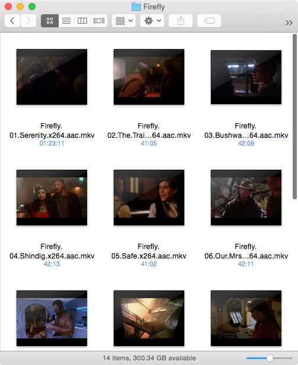
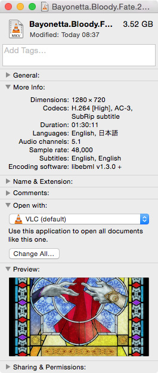
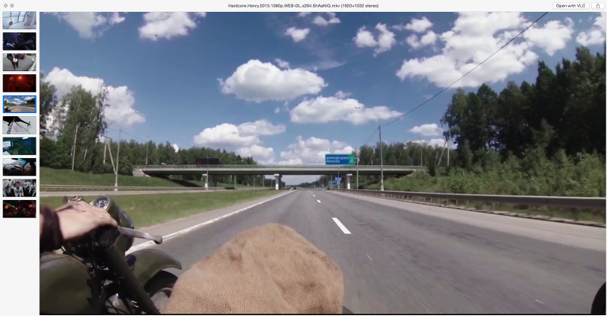

QuickLook Video
===============

This package allows macOS Finder to display thumbnails, static previews, cover art and metadata for most types of video files.

QuickLook and Spotlight on macOS 10.9 and later understand a limited number of media files - mostly only MPEG audio and video codecs within MPEG container files. This package adds support for wide range of other codecs and "non-native" media file types, including `.asf`, `.avi`, `.flv`, `.mkv`, `.rm`, `.webm`, `.wmf` etc.

Installation
------------
* Download the `.pkg` file of the [latest release](https://github.com/Marginal/QLVideo/releases/latest).
* Double-click on it.
* The Installer app will walk you through the installation process.
* To see thumbnails of video files you may need to relaunch Finder (ctrl-⌥-click on the Finder icon in the Dock and choose Relaunch) or log out and back in again.
* You may experience high CPU and disk usage for a few minutes after installation while Spotlight re-indexes all of your "non-native" audio and video files.

Alternatively, if you have [Homebrew](http://brew.sh/) installed, you can install using Homebrew [Cask](http://caskroom.io/):

    brew cask install qlvideo

Screenshots
-----------
  

Limitations
-----------
* QuickLook under Mavericks, Yosemite and El Capitan struggles with `.mp4` files. In particular, it won't let this plugin preview `.mp4` files that it can't handle itself (e.g. containing H.265 video) or you that you have asked it not to handle via the `SnapshotAlways` [setting](#customisation). Rename your `.mp4` files as `.m4v`, or use another container for H.265 content - e.g. [Matroska](http://www.matroska.org/).
* The QuickLook "Preview" function displays one or more static snapshots of "non-native" video files. You'll need a media player app (e.g. [VLC](http://www.videolan.org/vlc/) or [MPlayerX](http://mplayerx.org/)) to play these files.
* Interlaced content is sometimes not de-interlaced in QuickLook thumbnails and previews.
* Requires macOS 10.9 or later. Use [Perian](http://github.com/MaddTheSane/perian) for equivalent functionality under 10.8 and earlier.

Customisation
-----------
You can customise this plugin's behaviour by entering the following in the Terminal app:

 - `defaults write uk.org.marginal.qlvideo SnapshotAlways -bool XX` : Controls whether QuickLook "Preview" shows static snapshot(s) even if a playable preview is available. Default is `NO`.
 - `defaults write uk.org.marginal.qlvideo SnapshotCount -int XX` : Maximum number of snapshots to show in a QuickLook "Preview". Default is 10.
 - `defaults write uk.org.marginal.qlvideo SnapshotTime -int XX` : Time offset in seconds for thumbnails and for single snapshots. Unless the video clip is shorter than twice this value, in which case the snapshot is taken at the mid-point. Default is `60`.
    This setting doesn't affect thumbnails that have already been generated - use `qlmanage -r cache` and re-start Finder to force regeneration of existing thumbnails.


Uninstall
---------
* Run the Terminal app (found in `Applications` → `Utilities`).
* Copy the following and paste into the Terminal app:
```
sudo rm -rf "/Library/Application Support/QLVideo" "/Library/QuickLook/Video.qlgenerator" "/Library/Spotlight/Video.mdimporter"
```
* Press Enter.
* Type your password and press Enter.

Reporting bugs
--------------
* First, please check that you're running the [latest version](https://github.com/Marginal/QLVideo/releases/latest), log out of macOS and back in again and see if the problem remains.
* Open a [New issue](https://github.com/Marginal/QLVideo/issues/new) and describe the problem.
* To help diagnose the problem please run the Terminal app (found in Applications → Utilities) and type:
```
        qlmanage -m
        qlmanage -p -d1 /path/of/some/video/file
```
        qlmanage -p -d1 /path/of/some/video/file
but substitute the *path of some video file* by dragging a video file from the Finder and dropping it on the Terminal window.
* In the Terminal app choose `Edit` → `Select All` then `Edit` → `Copy` and `Paste` the results in the "New issue".

Acknowledgements
----------------
Uses the [FFmpeg](https://www.ffmpeg.org/about.html) libraries.

Packaged using [Packages](http://s.sudre.free.fr/Software/Packages/about.html).

License
-------
Copyright © 2014-2019 Jonathan Harris.

Licensed under the [GNU Public License (GPL)](http://www.gnu.org/licenses/gpl-2.0.html) version 2 or later.
